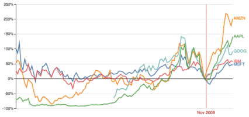

Overview
========

**stockAPI** is a study only purpose project to explore some free stock API available in internet.

Initial features:
-----------------

* List quotes from top 10 symbols
* List most active, gainers and losers
* Get market news from specific symbol
* Get current price of specific symbol
* Get quote of specific symbol
* Get Company info from specific symbol
* Show traded volume on the markets

.. attention::

   * This software is built for study purpose only.
   * I do not offer any support, you can fork or use this software with your own risk.
   * This software may use third-party libraries and modules, check their licenses and legal aspects before to install in your environment.
   * Any data resulted of this program execution such as stock recommendation, stock price etc should not be used as source for trading or any investments.
